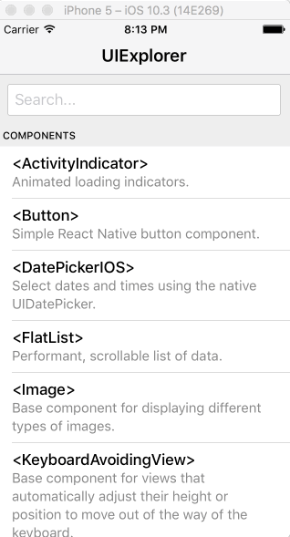
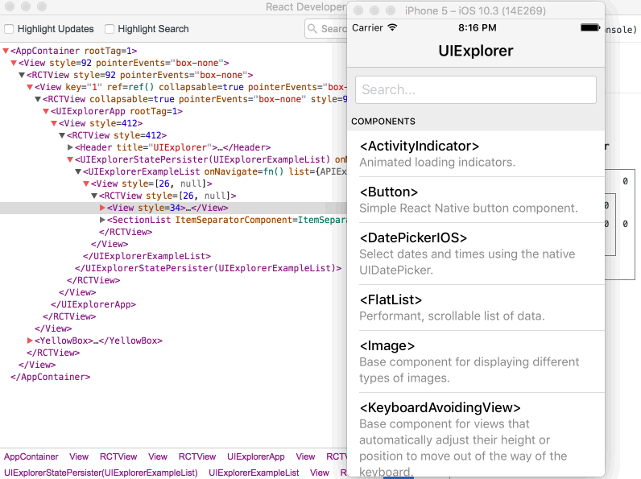
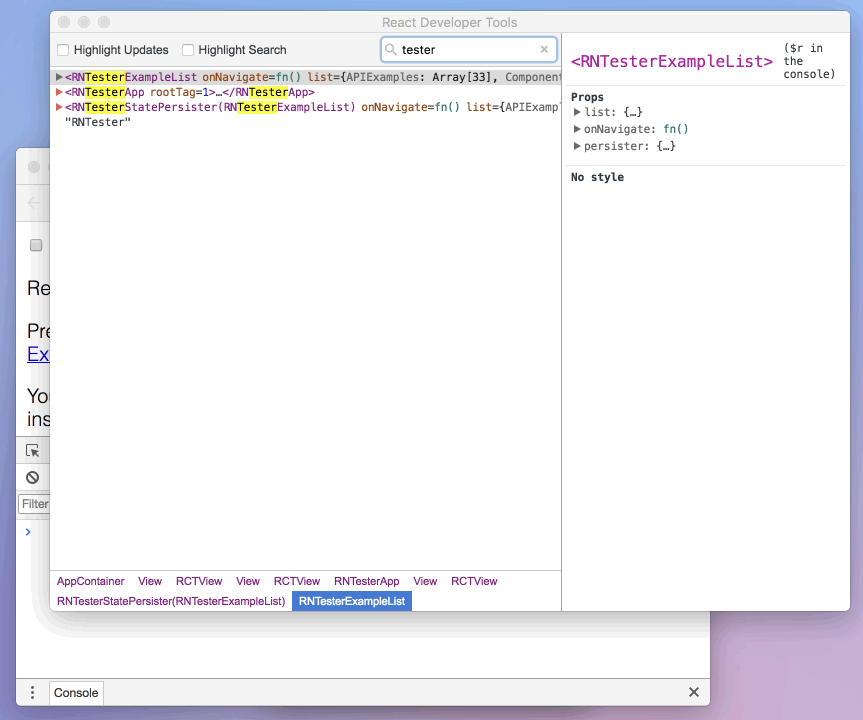

## 开启调试的快捷键

React Native 在 iOS 模拟器上支持一些快捷键操作，具体会在下文中描述。要使用快捷键请**务必确保模拟器的 Hardware 菜单中，Keyboard 选项下的"Connect Hardware Keyboard"处于开启状态**，否则按键是没有响应的。

## 访问 App 内的开发菜单

你可以通过摇晃设备或是选择 iOS 模拟器的"Hardware"菜单中的"Shake Gesture"选项来打开开发菜单。另外，如果是在 iOS 模拟器中运行，还可以按下**`Command`**`⌘` + **`D`** 快捷键，Android 模拟器对应的则是**`Command`**`⌘` + **`M`**（windows 上可能是 F1 或者 F2），或是直接在命令行中运行`adb shell input keyevent 82`来发送菜单键命令。


> 在发布（production）版本中开发者菜单将无法使用。

## 刷新 JavaScript

传统的原生应用开发中，每一次修改都需要重新编译，但在 RN 中你只需要刷新一下 JavaScript 代码，就能立刻看到变化。具体的操作就是在开发菜单中点击"Reload"选项。也可以在 iOS 模拟器中按下**`Command`**`⌘` + **`R`** ，Android 模拟器上对应的则是按两下**`R`** 。

### 自动刷新

选择开发菜单中的"Enable Live Reload"可以开启自动刷新，这样可以节省你开发中的时间。

更神奇的是，你还可以保持应用的当前运行状态，修改后的 JavaScript 文件会自动注入进来（就好比行驶中的汽车不用停下就能更换新的轮胎）。要实现这一特性只需开启开发菜单中的[Hot Reloading](https://facebook.github.io/react-native/blog/2016/03/24/introducing-hot-reloading.html)选项。

> 某些情况下 hot reload 并不能顺利实施。如果碰到任何界面刷新上的问题，请尝试手动完全刷新。

但有些时候你必须要重新编译应用才能使修改生效：

- 增加了新的资源(比如给 iOS 的`Images.xcassets`或是 Andorid 的`res/drawable`文件夹添加了图片)
- 更改了任何的原生代码（objective-c/swift/java）

## 应用内的错误与警告提示（红屏和黄屏）

红屏或黄屏提示都只会在开发版本中显示，正式的离线包中是不会显示的。

### 红屏错误

应用内的报错会以全屏红色显示在应用中（调试模式下），我们称为红屏（red box）报错。你可以使用`console.error()`来手动触发红屏错误。

### 黄屏警告

应用内的警告会以全屏黄色显示在应用中（调试模式下），我们称为黄屏（yellow box）报错。点击警告可以查看详情或是忽略掉。和红屏报警类似，你可以使用`console.warn()`来手动触发黄屏警告。在默认情况下，开发模式中启用了黄屏警告。可以通过以下代码关闭：

```javascript
console.disableYellowBox = true;
console.warn('YellowBox is disabled.');
```

你也可以通过代码屏蔽指定的警告，像下面这样调用 ignoreWarnings 方法，参数为一个数组：

```javascript
import {YellowBox} from 'react-native';
YellowBox.ignoreWarnings(['Warning: ...']);
```

在 CI/Xcode 中，黄屏警告还可以通过设置`IS_TESTING`环境变量来控制启用与否。

> 红屏错误和黄屏警告在发布版（release/production）中都是自动禁用的。

## Chrome 开发者工具

在开发者菜单中选择"Debug JS Remotely"选项，即可以开始在 Chrome 中调试 JavaScript 代码。点击这个选项的同时会自动打开调试页面 <http://localhost:8081/debugger-ui>.(如果地址栏打开的是 ip 地址，则请自行改为 localhost)

在 Chrome 的菜单中选择`Tools → Developer Tools`可以打开开发者工具，也可以通过键盘快捷键来打开（Mac 上是**`Command`**`⌘` + **`Option`**`⌥` + **`I`**，Windows 上是**`Ctrl`** + **`Shift`** + **`I`**或是 F12）。打开[有异常时暂停（Pause On Caught Exceptions）](http://stackoverflow.com/questions/2233339/javascript-is-there-a-way-to-get-chrome-to-break-on-all-errors/17324511#17324511)选项，能够获得更好的开发体验。

> 注意：Chrome 中并不能直接看到 App 的用户界面，而只能提供 console 的输出，以及在 sources 项中断点调试 js 脚本。一些老的教程和文章会提到 React 的 Chrome 插件，这一插件目前并不支持 React Native，而且调试本身并不需要这个插件。不过你可以安装独立（非插件）版本的 React Developer Tools 来辅助查看界面布局，下文会讲述具体安装方法。

> 注意：使用 Chrome 调试目前无法观测到 React Native 中的网络请求，你可以使用功能更强大的第三方的[react-native-debugger](https://github.com/jhen0409/react-native-debugger)来进行观测。

### 使用自定义的 JavaScript 调试器来调试

如果想用其他的 JavaScript 调试器来代替 Chrome，可以设置一个名为`REACT_DEBUGGER`的环境变量，其值为启动自定义调试器的命令。调试的流程依然是从开发者菜单中的"Debug JS Remotely"选项开始。

被指定的调试器需要知道项目所在的目录（可以一次传递多个目录参数，以空格隔开）。例如，如果你设定了`REACT_DEBUGGER="node /某个路径/launchDebugger.js --port 2345 --type ReactNative"`，那么启动调试器的命令就应该是`node /某个路径/launchDebugger.js --port 2345 --type ReactNative /某个路径/你的RN项目目录`。

> 以这种方式执行的调试器最好是一个短进程（short-lived processes），同时最好也不要有超过 200k 的文字输出。

## Safari Developer Tools

You can use Safari to debug the iOS version of your app without having to enable "Debug JS Remotely".

- Enable Develop menu in Safari: `Preferences → Advanced → Select "Show Develop menu in menu bar"`
- Select your app's JSContext: `Develop → Simulator → JSContext`
- Safari's Web Inspector should open which has a Console and a Debugger However, there are some disadvantages:

1. No sourcemaps when debugging
2. Every time the app is reloaded (using live reload, or by manually reloading), a new JSContext is created. Choosing "Automatically Show Web Inspectors for JSContexts" saves you from having to select the latest JSContext manually.

## React Developer Tools

You can use [the standalone version of React Developer Tools](https://github.com/facebook/react-devtools/tree/master/packages/react-devtools) to debug the React component hierarchy. To use it, install the `react-devtools` package globally:

```
npm install -g react-devtools
```

> 译注：react-devtools 依赖于 electron，而 electron 需要到国外服务器下载二进制包，所以国内用户这一步很可能会卡住。此时请在`环境变量`中添加 electron 专用的国内镜像源：`ELECTRON_MIRROR="https://npm.taobao.org/mirrors/electron/"`，然后再尝试安装 react-devtools。

安装完成后在命令行中执行`react-devtools`即可启动此工具：

```
react-devtools
```


It should connect to your simulator within a few seconds.

> Note: if you prefer to avoid global installations, you can add `react-devtools` as a project dependency. Add the `react-devtools` package to your project using `npm install --save-dev react-devtools`, then add `"react-devtools": "react-devtools"` to the `scripts` section in your `package.json`, and then run `npm run react-devtools` from your project folder to open the DevTools.

### Integration with React Native Inspector

Open the in-app developer menu and choose "Toggle Inspector". It will bring up an overlay that lets you tap on any UI element and see information about it:



However, when `react-devtools` is running, Inspector will enter a special collapsed mode, and instead use the DevTools as primary UI. In this mode, clicking on something in the simulator will bring up the relevant components in the DevTools:



You can choose "Toggle Inspector" in the same menu to exit this mode.

### Inspecting Component Instances

When debugging JavaScript in Chrome, you can inspect the props and state of the React components in the browser console.

First, follow the instructions for debugging in Chrome to open the Chrome console.

Make sure that the dropdown in the top left corner of the Chrome console says `debuggerWorker.js`. **This step is essential.**

Then select a React component in React DevTools. There is a search box at the top that helps you find one by name. As soon as you select it, it will be available as `$r` in the Chrome console, letting you inspect its props, state, and instance properties.



## 性能监测

你可以在开发者菜单中选择"Pref Monitor"选项以开启一个悬浮层，其中会显示应用的当前帧数。

<hr style="margin-top:25px; margin-bottom:25px;"/>

# Debugging in Ejected Apps

<div class="banner-crna-ejected" style="margin-top:25px">
  <h3>Projects with Native Code Only</h3>
  <p>
    The remainder of this guide only applies to projects made with <code>react-native init</code>
    or to those made with Create React Native App which have since ejected. For
    more information about ejecting, please see
    the <a href="https://github.com/react-community/create-react-native-app/blob/master/EJECTING.md" target="_blank">guide</a> on
    the Create React Native App repository.
  </p>
</div>

## 访问控制台日志

在运行 RN 应用时，可以在终端中运行如下命令来查看控制台的日志：

```
$ react-native log-ios
$ react-native log-android
```

此外，你也可以在 iOS 模拟器的菜单中选择`Debug → Open System Log...`来查看。如果是 Android 应用，无论是运行在模拟器或是真机上，都可以通过在终端命令行里运行`adb logcat *:S ReactNative:V ReactNativeJS:V`命令来查看。

> If you're using Create React Native App, console logs already appear in the same terminal output as the packager.

## 使用 Chrome 开发者工具来在设备上调试

> If you're using Create React Native App, this is configured for you already.

对于 iOS 真机来说，需要打开 [`RCTWebSocketExecutor.m`](https://github.com/facebook/react-native/blob/master/Libraries/WebSocket/RCTWebSocketExecutor.m)文件，然后将其中的"localhost"改为你的电脑的 IP 地址，最后启用开发者菜单中的"Debug JS Remotely"选项。

对于 Android 5.0+设备（包括模拟器）来说，将设备通过 USB 连接到电脑上后，可以使用[`adb`命令行工具](http://developer.android.com/tools/help/adb.html)来设定从设备到电脑的端口转发：

`adb reverse tcp:8081 tcp:8081`

如果设备 Android 版本在 5.0 以下，则可以在开发者菜单中选择"Dev Settings - Debug server host for device"，然后在其中填入电脑的”IP 地址:端口“。

> 如果在 Chrome 调试时遇到一些问题，那有可能是某些 Chrome 的插件引起的。试着禁用所有的插件，然后逐个启用，以确定是否某个插件影响到了调试。

## 调试原生代码

在和原生代码打交道时（比如编写原生模块），可以直接从 Android Studio 或是 Xcode 中启动应用，并利用这些 IDE 的内置功能来调试（比如设置断点）。这一方面和开发原生应用并无二致。
