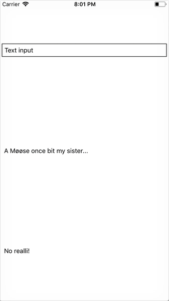

本组件用于解决一个常见的尴尬问题：手机上弹出的键盘常常会挡住当前的视图。本组件可以自动根据键盘的位置，调整自身的 position 或底部的 padding，以避免被遮挡。

用法：

```
import { KeyboardAvoidingView } from 'react-native';

<KeyboardAvoidingView style={styles.container} behavior="padding">
  ... 在这里放置需要根据键盘调整位置的组件 ...
</KeyboardAvoidingView>
```

### 示例



### 查看 Props

* [View props...](view.md#props)

- [`keyboardVerticalOffset`](keyboardavoidingview.md#keyboardverticaloffset)
- [`behavior`](keyboardavoidingview.md#behavior)
- [`contentContainerStyle`](keyboardavoidingview.md#contentcontainerstyle)

### 查看方法

* [`relativeKeyboardHeight`](keyboardavoidingview.md#relativekeyboardheight)
* [`onKeyboardChange`](keyboardavoidingview.md#onkeyboardchange)
* [`onLayout`](keyboardavoidingview.md#onlayout)

---

# 文档

## Props

### `keyboardVerticalOffset`

有时候应用离屏幕顶部还有一些距离（比如状态栏等等），利用此属性来补偿修正这段距离。

| 类型   | 必填 |
| ------ | ---- |
| number | 是   |

---

### `behavior`

_注意：Android 和 iOS 在此属性上表现并不一致。_ _Android 可能不指定此属性更好，而 iOS 可能相反。_

| 类型                                  | 必填 |
| ------------------------------------- | ---- |
| enum('height', 'position', 'padding') | 否   |

---

### `contentContainerStyle`

如果设定 behavior 值为'position'，则会生成一个 View 作为内容容器。此属性用于指定此内容容器的样式。

| 类型       | 必填 |
| ---------- | ---- |
| View.style | 否   |

## 方法

### `relativeKeyboardHeight()`

```javascript
relativeKeyboardHeight(keyboardFrame: object):
```

---

### `onKeyboardChange()`

```javascript
onKeyboardChange((event: object));
```

---

### `onLayout()`

```javascript
onLayout((event: ViewLayoutEvent));
```
